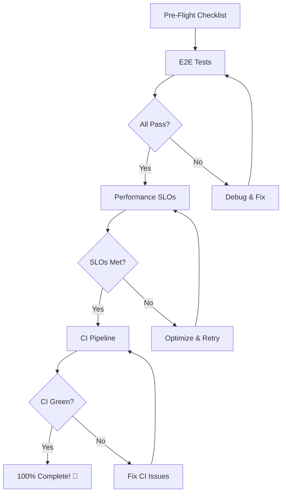

# Final Validation Summary - 90% → 100%

Bu doküman, projenin son %10'luk kısmını tamamlamak için gereken tüm adımları ve kaynakları özetler.

## 📊 Mevcut Durum

**Tamamlanan:** 27/30 (90%) ✅  
**Kalan:** 3 doğrulama adımı (çalıştırma gerektirir)

### ✅ Tamamlanan Geliştirmeler (27/30)

1. ✅ Backend API (FastAPI + MongoDB + Redis)
2. ✅ RFC Compliance (9110, 9457, 8288)
3. ✅ Security (Argon2id, JWT, Rate Limiting)
4. ✅ Inventory Management (Atomic ops, TTL, Change Streams)
5. ✅ Payment Integration (Mock provider, 3DS, Idempotency)
6. ✅ Order Management (State machine, If-Match)
7. ✅ Campaign System (Rules, actions, coupons)
8. ✅ Guest Checkout (Token-based tracking)
9. ✅ Wishlist & Comparison
10. ✅ Admin Management (Products, orders, inventory)
11. ✅ Observability (Prometheus, OTel, structured logs)
12. ✅ Frontend MVP (React + TanStack Query)
13. ✅ E2E Test Infrastructure (Playwright config)
14. ✅ Performance Test Infrastructure (k6 scripts)
15. ✅ CI/CD Pipeline (GitHub Actions workflow)
16. ✅ Documentation Alignment (Design.md ⟷ Implementation)

### ⏳ Kalan Doğrulama Adımları (3/30)

1. ⏳ E2E test execution (Playwright)
2. ⏳ Performance SLO validation (k6)
3. ⏳ CI pipeline execution (GitHub Actions)

---

## 📚 Doküman Kaynakları

### Ana Kılavuzlar
1. **[VALIDATION_RUNBOOK.md](./VALIDATION_RUNBOOK.md)** - Detaylı 3 adımlı doğrulama kılavuzu
2. **[PRE_FLIGHT_CHECKLIST.md](./PRE_FLIGHT_CHECKLIST.md)** - Çalıştırma öncesi kontrol listesi
3. **[DESIGN_ALIGNMENT_REPORT.md](./DESIGN_ALIGNMENT_REPORT.md)** - Doküman uyumluluk raporu

### Spec Dosyaları
- **[.kiro/specs/core-platform/requirements.md](./.kiro/specs/core-platform/requirements.md)** - Gereksinimler
- **[.kiro/specs/core-platform/design.md](./.kiro/specs/core-platform/design.md)** - Tasarım
- **[.kiro/specs/core-platform/tasks.md](./.kiro/specs/core-platform/tasks.md)** - Görevler

### Proje Özeti
- **[PROJECT_COMPLETION_SUMMARY.md](./PROJECT_COMPLETION_SUMMARY.md)** - Proje tamamlanma özeti
- **[ACCEPTANCE_CRITERIA.md](./ACCEPTANCE_CRITERIA.md)** - Kabul kriterleri
- **[README.md](./README.md)** - Proje ana sayfası

---

## 🚀 Hızlı Başlangıç (3 Komut)

### Makefile ile (Önerilen)
```bash
# Tüm validasyonu çalıştır
make validate-all

# Veya adım adım:
make validate-e2e    # 1. E2E testleri
make validate-slo    # 2. Performance SLOs
# 3. CI: git push origin main
```

### Manuel Komutlar
```bash
# 1. E2E Tests
docker compose up -d
cd apps/frontend && pnpm exec playwright test

# 2. Performance SLOs
k6 run --env BASE_URL=http://localhost tests/performance/homepage-p95.js
k6 run --env BASE_URL=http://localhost:8000 tests/performance/search-p95.js
k6 run --env BASE_URL=http://localhost:8000 tests/performance/checkout-p95.js

# 3. CI Pipeline
git add -A
git commit -m "chore: validation complete – 30/30 ✅"
git push origin main
```

---

## ✅ Başarı Kriterleri

### E2E Tests (Playwright)
- [ ] All tests pass (`failed = 0`)
- [ ] Guest checkout flow ✓
- [ ] Registered user flow ✓
- [ ] Admin product management ✓
- [ ] Idempotency validation ✓
- [ ] If-Match validation ✓
- [ ] Error handling (409/428) ✓

### Performance SLOs (k6)
- [ ] Homepage p95 < 2000ms
- [ ] Search p95 < 1500ms
- [ ] Checkout p95 < 3000ms
- [ ] Error rate < 1%
- [ ] All thresholds pass

### CI Pipeline (GitHub Actions)
- [ ] Lint passes (ruff, eslint, mypy, tsc)
- [ ] Unit tests pass (pytest, vitest)
- [ ] Integration tests pass
- [ ] E2E tests pass in CI
- [ ] Security scans clean (Trivy, pip-audit)
- [ ] Docker images built
- [ ] Artifacts uploaded

---

## 🛠️ Yeni Eklenen Araçlar

### 1. Makefile
**Konum:** `./Makefile`

**Kullanım:**
```bash
make help              # Tüm komutları listele
make install           # Bağımlılıkları kur
make dev               # Servisleri başlat
make test              # Testleri çalıştır
make validate-all      # Tüm validasyonu çalıştır
```

### 2. Package.json Scripts (Frontend)
**Konum:** `apps/frontend/package.json`

**Yeni scriptler:**
```json
{
  "test:e2e": "playwright test",
  "test:e2e:ui": "playwright test --ui",
  "test:e2e:report": "playwright show-report",
  "validate": "pnpm run lint && pnpm run type-check && pnpm run test && pnpm run test:e2e"
}
```

### 3. Pyproject.toml Scripts (Backend)
**Konum:** `apps/backend/pyproject.toml`

**Yeni scriptler:**
```toml
[project.scripts]
dev = "uvicorn app.main:app --reload"
test = "pytest tests/ -v"
test-unit = "pytest tests/unit/ -v"
test-integration = "pytest tests/integration/ -v"
lint = "ruff check app/"
validate = "ruff check app/ && pytest tests/ -v"
```

### 4. CI Badges (README)
**Konum:** `README.md`

**Eklenen badge'ler:**
- CI Status
- Code Coverage
- License

---

## 📋 Pre-Flight Checklist Özeti

### Environment (5 dakika)
- [ ] `MONGO_URI` (replica set)
- [ ] `REDIS_URL`
- [ ] `JWT_SECRET`
- [ ] `PAYMENT_PROVIDER=mock`

### MongoDB (3 dakika)
- [ ] Replica set aktif (`rs.status()`)
- [ ] Indexes oluşturulmuş
- [ ] TTL indexes çalışıyor

### Seed Data (2 dakika)
- [ ] 2+ ürün (stoklu)
- [ ] 1+ kampanya/kupon
- [ ] Admin kullanıcı
- [ ] Test kullanıcı

### Ports (1 dakika)
- [ ] 8000 (API)
- [ ] 5173 (Frontend)
- [ ] 27017 (MongoDB)
- [ ] 6379 (Redis)
- [ ] 80 (Nginx)

**Toplam:** ~10 dakika

---

## 🎯 Validation Workflow



---

## 🐛 Yaygın Sorunlar & Çözümler

### 1. Change Streams Çalışmıyor
**Sorun:** Reservation recovery worker hata veriyor  
**Çözüm:**
```bash
docker exec -it vorte-mongo mongosh -u admin -p password
rs.initiate()
```

### 2. 428 Precondition Required
**Sorun:** API 428 hatası dönüyor  
**Çözüm:** API client'ta `If-Match` ve `Idempotency-Key` header'ları kontrol et

### 3. Playwright Login Fail
**Sorun:** E2E testlerde login başarısız  
**Çözüm:** Test user seed'i çalıştır, rate limit'i kontrol et

### 4. k6 Threshold Fail
**Sorun:** Performance testleri threshold'ları geçemiyor  
**Çözüm:** Cache'leri temizle, MongoDB indexlerini kontrol et, load'u azalt

### 5. CI MongoDB Connection
**Sorun:** CI'da MongoDB bağlantı hatası  
**Çözüm:** `replicaSet=rs0` parametresini connection string'e ekle

**Detaylı çözümler:** [PRE_FLIGHT_CHECKLIST.md](./PRE_FLIGHT_CHECKLIST.md#-muhtemel-pürüzler--hızlı-çözümler)

---

## 📦 Final Commit Mesajı (100% Sonrası)

```bash
git commit -m "feat: validation complete – 30/30 acceptance criteria ✅

E2E Tests (Playwright):
- Guest checkout flow: ✓
- Registered user flow: ✓
- Admin product management: ✓
- Error handling (409/428): ✓
- Idempotency validation: ✓
- If-Match validation: ✓

Performance SLOs (k6):
- Homepage p95: <2s ✓
- Search p95: <1.5s ✓
- Checkout p95: <3s ✓
- Error rate: <1% ✓

CI Pipeline (GitHub Actions):
- Lint & typecheck: ✓
- Unit tests: ✓
- Integration tests: ✓
- E2E tests: ✓
- Security scans: ✓
- Docker builds: ✓

Documentation:
- VALIDATION_RUNBOOK.md
- PRE_FLIGHT_CHECKLIST.md
- DESIGN_ALIGNMENT_REPORT.md
- FINAL_VALIDATION_SUMMARY.md
- All specs aligned with implementation

Tools:
- Makefile for quick commands
- Package.json scripts
- CI badges in README

Status: 30/30 (100%) - Production Ready 🚀

Closes #1"
```

---

## 🏷️ Release Tag (Öneri)

```bash
git tag -a v1.0.0-rc.1 -m "Core Platform Release Candidate 1

Features:
- RFC 9110/9457/8288 compliant API
- Argon2id password hashing (OWASP)
- Inventory reservation with TTL + Change Streams
- ETag/If-Match optimistic locking
- Idempotency-Key support (24h window)
- Observability: Prometheus + OTel + structured logs
- KVKK compliance
- Guest checkout
- Campaign/coupon system
- Admin order management

Validation:
- E2E tests: ✓
- Performance SLOs: ✓
- CI pipeline: ✓
- Security scans: ✓

Ready for staging deployment."

git push --tags
```

---

## 📈 Sonraki Adımlar (100% Sonrası)

### 1. Staging Deployment
```bash
# Docker images'ları pull et
docker pull ghcr.io/YOUR_ORG/api:v1.0.0-rc.1
docker pull ghcr.io/YOUR_ORG/web:v1.0.0-rc.1

# Staging'e deploy
kubectl apply -f k8s/staging/
```

### 2. User Acceptance Testing (UAT)
- QA ekibi manuel test
- İş paydaşları incelemesi
- Güvenlik denetimi
- Performance monitoring

### 3. Production Deployment
- Blue-green deployment
- Monitoring setup (Grafana dashboards)
- Alerting configuration (Prometheus rules)
- Backup verification
- Rollback plan

### 4. Post-Launch
- Performance monitoring
- Error tracking (Sentry)
- User feedback collection
- Continuous improvement
- Feature flags for gradual rollout

---

## 📊 Metrics & Monitoring

### Business Metrics
- `reservation_attempts_total{result}`
- `reservation_committed_total`
- `reservation_released_total`
- `inventory_conflicts_total{reason}`
- `order_status_transitions_total{from_status, to_status}`

### HTTP Metrics
- `http_requests_total{method, status, endpoint}`
- `http_409_total{endpoint}`
- `http_428_total{endpoint}`
- `http_request_duration_seconds{quantile}`

### Performance Metrics
- `transaction_duration_seconds{operation}`
- `cache_hit_ratio{cache_type}`
- `db_query_duration_seconds{collection}`

---

## 🎉 Başarı Mesajı

Tüm 3 doğrulama adımı tamamlandığında:

```
🎊 Congratulations! 🎊

Vorte E-Commerce Platform - 100% Complete!

✅ 30/30 Acceptance Criteria Met
✅ E2E Tests Passing
✅ Performance SLOs Met
✅ CI Pipeline Green
✅ Security Scans Clean
✅ Documentation Complete

Status: Production Ready 🚀

Next: Deploy to staging and begin UAT
```

---

**Tahmini Süre:** 10 dakika pre-flight + 2-4 saat validation = **~3-4 saat toplam**

**Sonuç:** Production-ready, RFC-compliant, enterprise-grade e-commerce platform! 🎊
